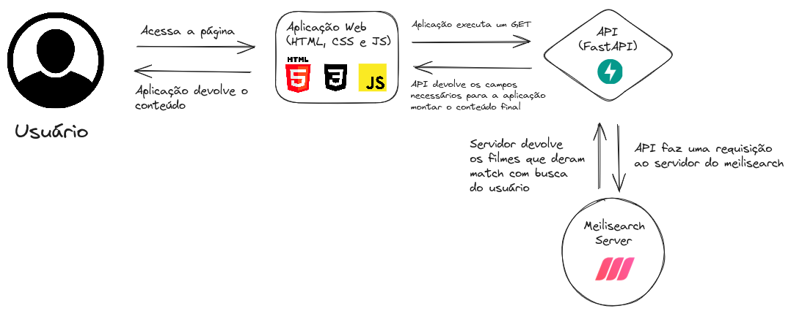

# CineQuest

## Description
CineQuest é uma aplicação web onde visa a busca de filmes, com a possibilidade de visualizar detalhes sobre o filme, como: sinopse e ano de lançamento.
Cinequest foi o início de um projeto maior que só veio a tona devido à competição do time da Alura, na qual agradeço a inspiração e conteúdo ministrados na semana da imersão dev, sem isso, eu não conseguiria ter aprendido ferramentas como: html, css e javascript.

## Tecnologias

Na imagem abaixo tem o pipeline de tecnologias utilizadas no projeto.



O desafio consistia em fazer uma aplicação web, focada no frontend. Por isso o backend deste projeto é relativamente simples e não foi levado em conta todas as questões de segurança e performance que um projeto real necessitaria. Mas serviu como base para enriquecer o que o frontend poderia fazer.

## Como rodar o projeto
O Projeto está acessível na página (colocar link).

Caso queira rodar localmente, basta ter o docker instalado e rodar o comando abaixo:

```bash
docker-compose up
```
